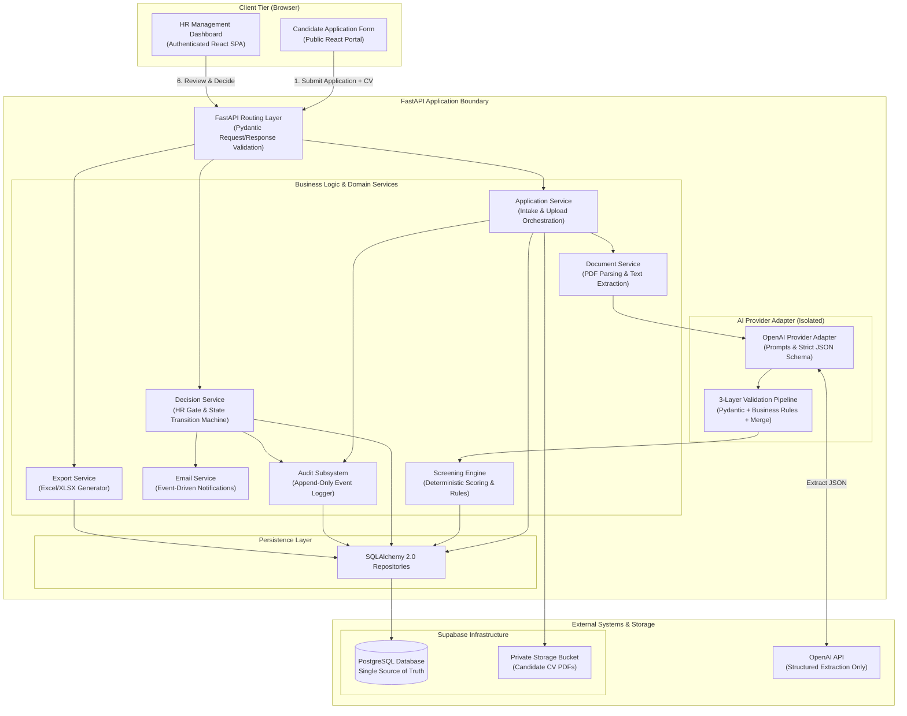
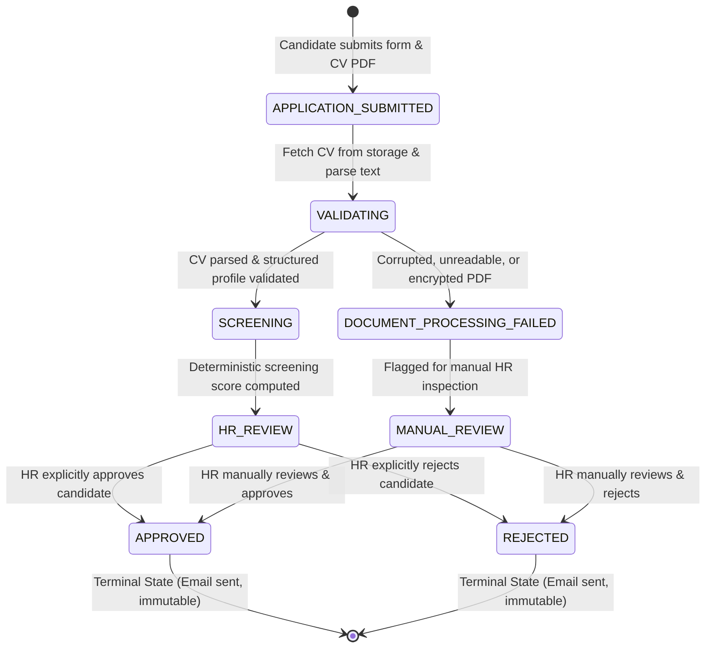
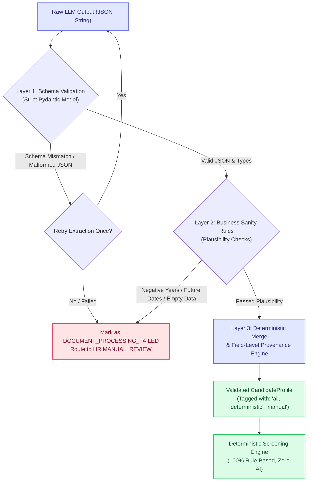
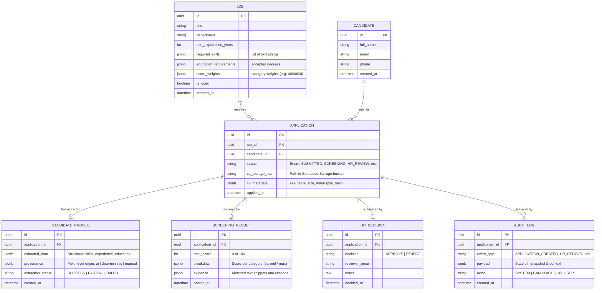
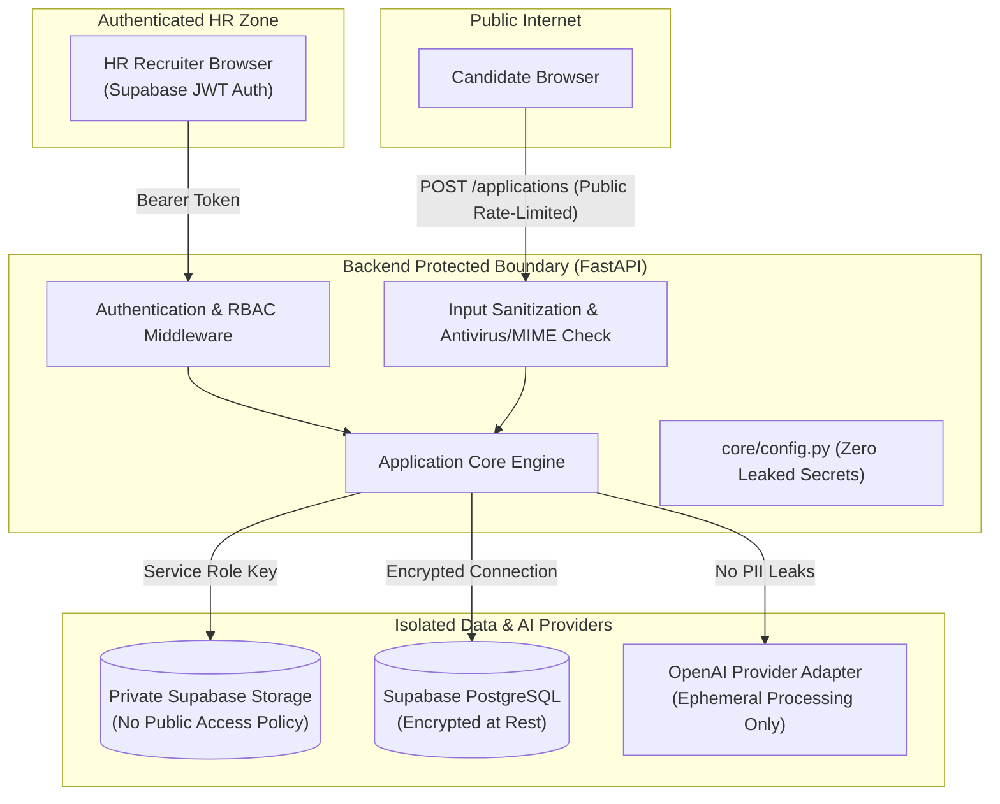

# ARCHITECTURE.md

# AI-Assisted HR Recruitment Screening Platform

## 1. Purpose

This document is the **authoritative engineering architecture** for the HR recruitment screening platform.

It exists to prevent:

- Uncontrolled AI behavior
- Hallucinated candidate information reaching HR
- Invalid workflow transitions
- Accidental automation of consequential decisions
- Unclear module responsibilities
- Inconsistent screening logic
- Data corruption and fragmented records

Any developer or AI coding agent working on this project MUST follow this document.
If a proposed implementation conflicts with it, the implementation is reconsidered before coding.

Business rationale lives in `client-brief.md`. This doc explains *what the system is* and *why it is shaped this way*, so both are readable in one place.

---

## 2. The Core Principle

> **AI assists the recruitment process. It never controls it.**

Concretely:

| Concern | Owner |
|---|---|
| Extracting skills/experience from unstructured CV text | AI (OpenAI) |
| Deciding whether extraction output is trustworthy | Deterministic validation code |
| Scoring candidates against job requirements | Deterministic screening engine |
| Approving or rejecting a candidate | HR (human-in-the-loop) |
| Triggering emails to candidates | System, only after an HR decision |
| State transitions, permissions, persistence | Application code |

The AI has exactly one job: convert unstructured CV text into structured data.
It cannot change application status, cannot compute scores, and cannot contact anyone.

---

## 3. How the System Solves the Business Problems

Each of the 10 business gaps identified in `client-brief.md` maps directly to a concrete architectural subsystem:

```mermaid
graph TD
    classDef gap fill:#FFE4E6,stroke:#F43F5E,stroke-width:2px,color:#881337;
    classDef solution fill:#E0E7FF,stroke:#6366F1,stroke-width:2px,color:#312E81;
    classDef outcome fill:#DCFCE7,stroke:#22C55E,stroke-width:2px,color:#14532D;

    subgraph BusinessGaps["10 Core Business Gaps"]
        G1["Gap 1: Manual CV Reading"]:::gap
        G2["Gap 2: Repetitive Data Entry"]:::gap
        G3["Gap 3: Inconsistent Screening"]:::gap
        G4["Gap 4: Opaque Scoring Criteria"]:::gap
        G5["Gap 5: HR Accountability & Authority"]:::gap
        G6["Gap 6: Manual Email Communication"]:::gap
        G7["Gap 7: Fragmented Data"]:::gap
        G8["Gap 8: Manual Excel Reports"]:::gap
        G9["Gap 9: Lack of Traceability"]:::gap
        G10["Gap 10: AI Hallucination & Risk"]:::gap
    end

    subgraph ArchitectureEngine["Architectural Solution & Subsystems"]
        S1["Document Service + OpenAI Adapter"]:::solution
        S2["Application Intake & Schema Auto-Mapping"]:::solution
        S3["Deterministic Rule-Based Screening Engine"]:::solution
        S4["Score Breakdown & Evidence Extractor"]:::solution
        S5["Human-in-the-Loop Decision Gate"]:::solution
        S6["Event-Driven Candidate Email Service"]:::solution
        S7["Supabase PostgreSQL Central Source of Truth"]:::solution
        S8["Automated Excel Export Service"]:::solution
        S9["Append-Only Audit Log Subsystem"]:::solution
        S10["3-Layer Validation & Provenance Engine"]:::solution
    end

    subgraph BusinessValue["Business Value Delivered"]
        V1["90% Time Saved in Initial Review"]:::outcome
        V2["Zero Manual Profile Typing"]:::outcome
        V3["100% Objective & Fair Evaluation"]:::outcome
        V4["Auditable, Explainable Decisions"]:::outcome
        V5["Human Keeps Total Governance"]:::outcome
        V6["Instant, Professional Candidate Updates"]:::outcome
        V7["Unified Centralized Records"]:::outcome
        V8["One-Click Stakeholder Reporting"]:::outcome
        V9["Complete Legal & Operational Traceability"]:::outcome
        V10["Zero Hallucinations in Database"]:::outcome
    end

    G1 --> S1 --> V1
    G2 --> S2 --> V2
    G3 --> S3 --> V3
    G4 --> S4 --> V4
    G5 --> S5 --> V5
    G6 --> S6 --> V6
    G7 --> S7 --> V7
    G8 --> S8 --> V8
    G9 --> S9 --> V9
    G10 --> S10 --> V10
```



| # | Business Gap | Problem in Manual Process | Architectural Answer | Business Impact |
|---|---|---|---|---|
| 1 | **Manual CV Reading** | Hundreds of unstructured CV formats take hours to read | `DocumentService` + OpenAI extraction → structured candidate profile | 90% reduction in initial reading time |
| 2 | **Repetitive Data Entry** | Typing names, emails, and experience into spreadsheets | Public intake form automatically seeds normalized DB records | Eliminates data entry errors & backlog |
| 3 | **Inconsistent Screening** | Different recruiters use subjective criteria | Deterministic screening engine evaluates candidates against strict job criteria | 100% repeatable, fair evaluation |
| 4 | **Opaque Scoring** | A score like "85" has no explanation | Persistent score breakdown (earned/max points per category) + evidence | Explainable decisions backed by exact citations |
| 5 | **HR Accountability** | Risk of AI making unauthorized hiring/rejection | Hard decision gate: AI cannot alter status; only authorized HR can approve/reject | Human judgment and accountability preserved |
| 6 | **Manual Candidate Emails** | Drafting individual emails is time-consuming | `EmailService` automatically drafts/sends notification only after HR decision | Instant, consistent candidate feedback |
| 7 | **Fragmented Data** | Resumes in inboxes, notes in files, scores in sheets | Supabase PostgreSQL single source of truth + private bucket storage | Centralized, secure talent repository |
| 8 | **Manual Reporting** | Hours spent consolidating spreadsheets for management | Streaming Excel export endpoint (`/exports/applications`) from DB | Instant reporting with up-to-date data |
| 9 | **Lack of Traceability** | No historical record of who evaluated what and when | Append-only `audit_log` records every transition, payload, and reviewer | Complete operational & compliance trail |
| 10 | **AI Unreliability** | LLMs can hallucinate qualifications or make errors | 3-Layer validation (Pydantic → business bounds → deterministic merge + provenance) | Zero unverified AI data enters screening |

---

## 4. System Boundary

**In scope:**

    Candidate application → Document processing → AI extraction
    → 3-Layer Validation → Screening → HR review → HR decision → Email → Reporting → Audit

**Explicitly out of scope** (future phases, require new approval):

Interview scheduling · Calendar management · WhatsApp communication · Meeting creation · Automatic hiring/rejection · Candidate pipeline analytics

---

## 5. High-Level Component Architecture



---

## 6. End-to-End Flow, Step by Step

The complete life of one application, from submission to closure:

```mermaid
sequenceDiagram
    autonumber
    actor Candidate as Candidate
    participant FE as Frontend Portal
    participant API as FastAPI Backend
    participant Storage as Supabase Storage
    participant DocSvc as Document Service
    participant OpenAI as OpenAI Adapter
    participant Val as 3-Layer Validation
    participant Screen as Screening Engine
    participant DB as PostgreSQL DB
    actor HR as HR Reviewer
    participant Email as Email Service
    participant Audit as Audit Log

    Candidate->>FE: Fill form (job, name, email) + upload CV.pdf
    FE->>API: POST /api/applications (multipart/form-data)
    API->>API: Validate file type (.pdf) and max file size
    API->>Storage: Store CV in private bucket ('candidate-cvs')
    Storage-->>API: cv_storage_path
    API->>DB: Insert Candidate + Application (Status: APPLICATION_SUBMITTED)
    API->>Audit: Record 'APPLICATION_CREATED' event

    API->>DocSvc: Read CV binary from storage & extract raw text
    alt PDF extraction fails (corrupt / unreadable)
        DocSvc-->>API: Extraction Error
        API->>DB: Update status to DOCUMENT_PROCESSING_FAILED
        API->>Audit: Record 'DOCUMENT_PROCESSING_FAILED'
        Note over API,DB: Routed to manual review queue; never silently dropped.
    else Extraction succeeds
        DocSvc-->>API: Extracted raw CV text
        API->>OpenAI: Request candidate structured extraction
        OpenAI-->>Val: Raw JSON output
        Val->>Val: Layer 1: Pydantic schema validation
        Val->>Val: Layer 2: Business sanity rules (experience, skills)
        Val->>Val: Layer 3: Deterministic merge + provenance tagging
        Val-->>API: Validated CandidateProfile
        API->>DB: Insert CandidateProfile (Status: SCREENING)
        API->>Audit: Record 'EXTRACTION_COMPLETED'
    end

    API->>Screen: Score CandidateProfile against Job requirements
    Screen->>Screen: Calculate Experience + Skill Match + Education Points
    Screen-->>API: ScreeningResult (Total score, Breakdown, Evidence citations)
    API->>DB: Insert ScreeningResult (Status: HR_REVIEW)
    API->>Audit: Record 'SCREENING_COMPLETED'

    HR->>FE: Open HR Dashboard & inspect candidate dossier
    FE->>API: GET /api/hr/applications/{id}
    API-->>FE: Return Profile + Score Breakdown + Evidence + Audit Trail
    
    HR->>FE: Click Approve or Reject (with reviewer notes)
    FE->>API: POST /api/hr/applications/{id}/decision {decision, notes}
    API->>API: Enforce state machine (terminal state check)
    API->>DB: Insert HRDecision, Update status to APPROVED / REJECTED
    API->>Audit: Record 'HR_DECIDED' event

    API->>Email: Trigger notification workflow
    Email-->>Candidate: Dispatch Approval / Rejection Email
    API->>Audit: Record 'EMAIL_SENT' event with rendered snapshot

    Note over HR,API: At any time, HR can trigger GET /api/exports/applications to generate an Excel spreadsheet.
```

---

## 7. Application State Machine

Statuses are explicit and transitions are strictly enforced in code. Arbitrary or backward state transitions are forbidden.



**State Transition Invariants:**
1. `APPROVED` and `REJECTED` are strictly terminal. Once decided, the state is locked forever.
2. An application can never bypass the `HR_REVIEW` or `MANUAL_REVIEW` gate to reach `APPROVED` or `REJECTED`.
3. Every state transition automatically writes a corresponding row to `audit_log`.

---

## 8. AI Reliability: 3-Layer Validation Pipeline

To eliminate hallucination and guarantee data integrity (Business Gap 10):



- **Layer 1 — Pydantic:** Enforces exact schemas and strict types. Malformed LLM output never touches domain models.
- **Layer 2 — Business Rules:** Validates human sanity bounds (e.g. years of experience between 0 and 50, normalized education levels, non-empty skills).
- **Layer 3 — Deterministic Merge & Provenance:** Missing or partial fields are enriched by deterministic regex/keyword parsing directly from the CV text. Every single field tracks its provenance (`ai`, `deterministic`, or `manual`).

---

## 9. Data Model & Entity Relationships

PostgreSQL is the single source of truth. Binary files stay in Supabase Storage; the DB holds relational records, structured profiles, evidence JSON, and audit events.



---

## 10. Security & Privacy Architecture



**Security Rules:**
1. `.env` and all keys are strictly gitignored. `service_role` key exists only server-side.
2. The Storage bucket is private; CV downloads happen through authenticated backend endpoints only.
3. Every API boundary validates input (file type, size, field schemas).
4. Uploaded CVs and databases are never committed; sample data must be fictional.
5. The audit log is append-only.

---

## 11. Module Responsibilities

Backend layout mirrors responsibility boundaries. Routes are thin; services orchestrate; repositories own SQL; provider adapters isolate third-party SDK types.

| Module | Owns | Must NOT |
|---|---|---|
| `api/routes/` | HTTP parsing, auth, response models, status codes | Contain business logic or SQL |
| `services/` | Workflow orchestration, state transitions | Talk to HTTP or write raw queries directly in routes |
| `repositories/` | All SQLAlchemy access | Know about HTTP or prompts |
| `ai/` + `providers/` | OpenAI prompts, adapters, extraction schemas | Leak SDK types beyond their boundary |
| `core/config.py` | The only place settings/env are read | Be bypassed by `os.getenv` elsewhere |
| `db/` | Session/engine setup | Own schema (that's Alembic) |
| `schemas/` | Pydantic request/response contracts | Duplicate model logic ad hoc |

Frontend (`frontend/`): React SPA (Vite, TypeScript strict, Tailwind, shadcn/ui, React Router). Talks only to the backend API through `src/lib/api.ts`; env vars read only via `src/lib/env.ts`.

---

## 12. Locked Technical Decisions

These are settled; changing any of them requires explicit re-approval:

1. **Extraction:** OpenAI as the sole AI provider, behind adapter interfaces in `app/providers/`. No separate document-intelligence service. Deterministic merging fills gaps and exposes provenance.
2. **Database:** Supabase Postgres everywhere (dev and prod), SQLAlchemy models, Alembic migrations. SQLite is not used.
3. **File storage:** Supabase Storage private bucket; DB stores path/metadata only, never binaries.
4. **Email:** `EmailService` interface with pluggable transport. MVP ships a console/file transport for development; a real transactional provider is added later without touching workflow code.
5. **Auth:** Supabase email auth for the HR side (no SSO); public application form requires no login.
6. **Export:** Excel generation from Postgres, isolated in `export_service.py`.
7. **Dependencies:** exact pins only, lockfiles committed, cooldown configs preserved, nothing added without Tasya's approval.
8. **No automated test suites** — verification is lint/typecheck/build plus demo-oriented walkthroughs of the fictional corpus.
