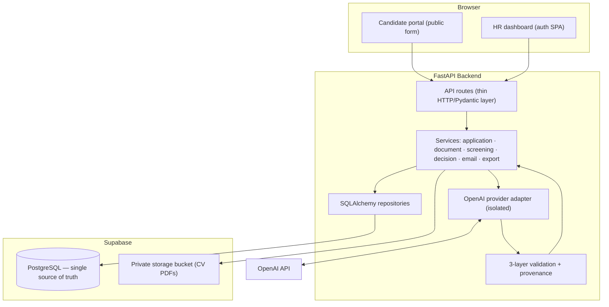
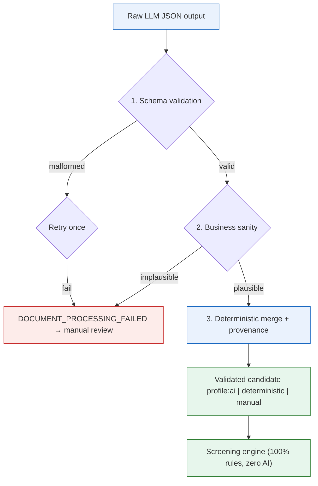
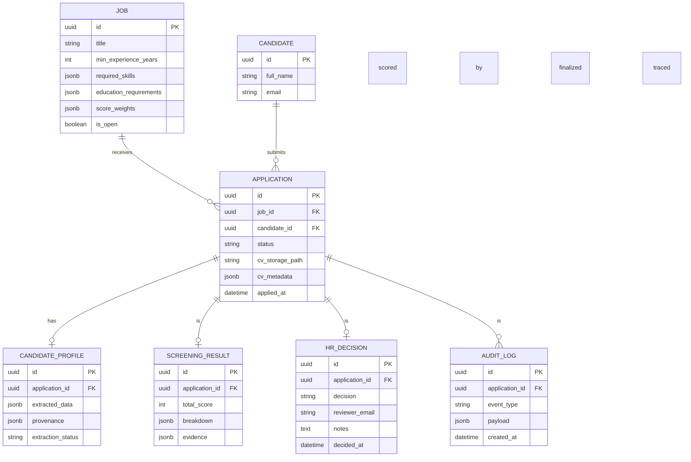

# ARCHITECTURE.md

# AI-Assisted HR Recruitment Screening Platform

## 1. Purpose

This document is the **authoritative engineering architecture** for the HR recruitment screening platform. It must be followed by any developer or AI coding agent working on this project. If a proposed implementation conflicts with it, the implementation is reconsidered *before* code is written.

It exists to keep the system:

- **Controlled** — AI can never make or alter a consequential decision
- **Predicable** — every workflow transition is explicit and enforced
- **Explainable** — every score is backed by a breakdown and evidence
- **Traceable** — every important action leaves an audit record
- **Safe** — malformed or hallucinated AI output is blocked before persistence

Business rationale lives in `client-brief.md` (the *why*). This document is the *what* and the *how*.

---

## 2. The Core Principle

> **AI assists the recruitment process. It never controls it.**

| Concern | Owner |
|---|---|
| Turning unstructured CV text into structured data | AI (OpenAI) |
| Deciding whether that data is trustworthy | Deterministic validation code |
| Scoring a candidate against job requirements | Deterministic screening engine |
| Approving or rejecting a candidate | Human-in-the-loop (HR) |
| Sending the candidate an email | System, only *after* an HR decision |
| State transitions, permissions, persistence | Application code |

The AI has exactly one job: convert CV text into structured data. It cannot change application status, compute scores, or contact anyone.

---

## 3. How the System Solves the Business Problems

Each of the ten gaps in `client-brief.md` maps to a concrete subsystem.

| # | Business Gap | Architectural Answer |
|---|---|---|
| 1 | Manual CV reading | Document service + OpenAI extraction → structured profile |
| 2 | Repetitive data entry | Intake form seeds normalized records automatically |
| 3 | Inconsistent screening | Deterministic rules engine against per-job requirements |
| 4 | Opaque scores ("85") | Persistent score breakdown + evidence per category |
| 5 | HR accountability | Hard decision gate — only HR can approve/reject |
| 6 | Manual candidate emails | Email service fires automatically after the HR decision |
| 7 | Fragmented data | Supabase Postgres + private storage = single source of truth |
| 8 | Manual reporting | Streaming Excel export from the database |
| 9 | No traceability | Append-only audit log on every transition |
| 10 | AI unreliability | 3-layer validation: schema → business rules → deterministic merge |

---

## 4. System Boundary

**In scope:**

    Candidate application → CV processing → AI extraction → validation
    → screening → HR review → HR decision → candidate email → reporting → audit

**Explicitly out of scope** (future phases, require new approval):

Interview scheduling · Calendar management · WhatsApp · Meeting creation · Automatic hiring/rejection · Pipeline analytics

---

## 5. Component Architecture



**Flow of responsibility:** routes only parse HTTP → services orchestrate the workflow → repositories own all SQL → the OpenAI adapter is the *only* file that touches the OpenAI SDK → validation must approve AI output before anything is persisted or scored.

---

## 6. End-to-End Workflow, Step by Step

This is the full life of one application, from submission to closure, numbered in the order it happens.

1. **Submit** — candidate fills the form (job, name, email) and uploads a CV PDF.
2. **Validate** — the API checks the fields and rejects bad file types/sizes.
3. **Store** — the CV PDF is uploaded to the private bucket; only the path + metadata are kept in the DB (never the binary).
4. **Extract text** — the document service downloads the CV and pulls plain text from the PDF.
5. **AI extraction** — the extract adapter sends the text to OpenAI with a narrow prompt and a strict JSON schema.
6. **Validate output** — the 3-layer pipeline (schema → business rules → deterministic merge) verifies and tags the profile.
7. **Score** — the screening engine computes a deterministic score, breakdown, and evidence against the job's requirements.
8. **Review** — HR opens the dossier: profile, score breakdown, evidence, and audit history.
9. **Decide** — HR clicks Approve or Reject (with notes). The state machine allows no further transitions.
10. **Email** — the email service sends the matching notification *only now*, purely as a result of HR's decision.
11. **Report** — at any point HR can export the data to Excel via the export endpoint.

### Operational Flow (Visual Summary)

```mermaid
flowchart TD
    %% Styling
    classDef start fill:#E3F2FD,stroke:#1565C0,stroke-width:2px,color:#0D47A1;
    classDef process fill:#F3E5F5,stroke:#7B1FA2,stroke-width:2px,color:#4A148C;
    classDef decision fill:#FFF3E0,stroke:#E65100,stroke-width:2px,color:#E65100;
    classDef success fill:#E8F5E9,stroke:#2E7D32,stroke-width:2px,color:#1B5E20;
    classDef fail fill:#FFEBEE,stroke:#C62828,stroke-width:2px,color:#B71C1C;
    classDef external fill:#ECEFF1,stroke:#546E7A,stroke-width:1px,stroke-dasharray: 5 5,color:#37474F;

    %% Nodes
    START([Candidate submits\napplication + CV]):::start
    VALIDATE{Validate\nfields + file}:::decision
    STORE[Store CV in\nSupabase Storage]:::process
    DB_CREATE[(Create candidate +\napplication record\nStatus: SUBMITTED)]:::process
    AUDIT1[Audit: APPLIED]:::process
    EXTRACT[Document Service:\nExtract PDF text]:::process
    EXTRACT_OK{PDF\nreadable?}:::decision
    FAIL_PDF[Status: DOCUMENT_PROCESSING_FAILED\n→ Manual Review]:::fail
    AUDIT_FAIL[Audit: FAILED]:::fail
    AI_EXTRACT[OpenAI Adapter:\nExtract structured profile]:::external
    VALIDATE_PIPE[3-Layer Validation:\nSchema → Business → Merge]:::process
    PROFILE_OK[Validated profile\nwith provenance]:::success
    DB_PROFILE[(Persist profile\nStatus: SCREENING)]:::process
    AUDIT_EXT[Audit: EXTRACTED]:::process
    SCREEN[Screening Engine:\nDeterministic scoring]:::process
    RESULT[Score + Breakdown +\nEvidence]:::success
    DB_SCREEN[(Persist result\nStatus: HR_REVIEW)]:::process
    AUDIT_SCR[Audit: SCREENED]:::process
    HR_REVIEW[HR opens dossier\nreviews profile + score]:::process
    HR_DECIDE{HR decision:\nApprove or Reject}:::decision
    DB_DECISION[(Persist decision\nStatus: APPROVED/REJECTED)]:::success
    AUDIT_DEC[Audit: DECIDED]:::process
    EMAIL[Email Service:\nSend notification]:::process
    AUDIT_EMAIL[Audit: EMAILED]:::process
    EXPORT[Export to Excel\n(any time)]:::process

    %% Flow
    START --> VALIDATE
    VALIDATE -->|valid| STORE
    VALIDATE -->|invalid| START
    STORE --> DB_CREATE
    DB_CREATE --> AUDIT1
    AUDIT1 --> EXTRACT
    EXTRACT --> EXTRACT_OK
    EXTRACT_OK -->|no| FAIL_PDF
    FAIL_PDF --> AUDIT_FAIL
    EXTRACT_OK -->|yes| AI_EXTRACT
    AI_EXTRACT --> VALIDATE_PIPE
    VALIDATE_PIPE --> PROFILE_OK
    PROFILE_OK --> DB_PROFILE
    DB_PROFILE --> AUDIT_EXT
    AUDIT_EXT --> SCREEN
    SCREEN --> RESULT
    RESULT --> DB_SCREEN
    DB_SCREEN --> AUDIT_SCR
    AUDIT_SCR --> HR_REVIEW
    HR_REVIEW --> HR_DECIDE
    HR_DECIDE --> DB_DECISION
    DB_DECISION --> AUDIT_DEC
    AUDIT_DEC --> EMAIL
    EMAIL --> AUDIT_EMAIL
    AUDIT_EMAIL --> EXPORT
    EXPORT -.->|anytime| HR_REVIEW

---

## 7. Application State Machine

Transitions are explicit and enforced in code. No backward moves, no skipping the review gate, no second decision.

```mermaid
stateDiagram-v2
    [*] --> APPLICATION_SUBMITTED: valid upload
    APPLICATION_SUBMITTED --> VALIDATING: CV fetched, parsing text
    VALIDATING --> SCREENING: profile validated
    VALIDATING --> DOCUMENT_PROCESSING_FAILED: unreadable PDF
    DOCUMENT_PROCESSING_FAILED --> MANUAL_REVIEW: HR inspection
    SCREENING --> HR_REVIEW: score computed
    HR_REVIEW --> APPROVED: HR approves
    HR_REVIEW --> REJECTED: HR rejects
    MANUAL_REVIEW --> APPROVED: HR manual approve
    MANUAL_REVIEW --> REJECTED: HR manual reject
    APPROVED --> [*]
    REJECTED --> [*]
```

Invariants:

1. `APPROVED` and `REJECTED` are terminal and irreversible.
2. `APPROVED`/`REJECTED` are only reachable through the `HR_REVIEW` or `MANUAL_REVIEW` gate — AI can never route an application there directly.
3. Every transition writes one `audit_log` row (who, what, when, payload snapshot).

---

## 8. AI Reliability: The 3-Layer Validation Pipeline

The defense against hallucinated or malformed AI output (Business Gap 10):



- **Layer 1 — Pydantic:** strict schema and types. Malformed output never reaches the domain.
- **Layer 2 — Business rules:** plausible human bounds only (e.g. experience 0–50 years, normalized education, non-empty skills). Implausible values are rejected, not silently clamped.
- **Layer 3 — Deterministic merge:** fields the model missed are filled by deterministic parsing of the CV text. Every field carries a provenance tag (`ai` / `deterministic` / `manual`) so HR always knows its origin.

The screening engine consumes only validated profiles. It contains zero AI.

---

## 9. Data Model

Postgres is the source of truth. Binaries live in Storage; the DB holds references.



Schema changes go through Alembic migrations only — never manual dashboard edits.

---

## 10. Module Responsibilities

Routes are thin, services orchestrate, repositories own SQL, provider adapters isolate third-party SDK types.

| Module | Owns | Must NOT |
|---|---|---|
| `api/routes/` | HTTP parsing, auth, response models, status codes | Business logic or SQL |
| `services/` | Workflow orchestration, state transitions | Talk to HTTP or write raw SQL |
| `repositories/` | All SQLAlchemy access | Know about HTTP or prompts |
| `ai/` + `providers/` | OpenAI prompts, adapters, extraction schemas | Leak SDK types beyond the boundary |
| `core/config.py` | The only place settings/env are read | Be bypassed by `os.getenv` elsewhere |
| `schemas/` | Pydantic request/response contracts | Duplicate model logic |
| `db/` | Session/engine setup | Own schema (Alembic does) |

Frontend (`frontend/`): React SPA (Vite, TypeScript strict, Tailwind, shadcn/ui, React Router). It talks only to the backend API through `src/lib/api.ts`; env vars are read only through `src/lib/env.ts`.

---

## 11. Locked Technical Decisions

Settled. Changing any of them requires explicit re-approval.

1. **Extraction:** OpenAI is the sole AI provider, behind adapters in `app/providers/`. No separate document-intelligence service. Deterministic merging fills gaps and exposes provenance.
2. **Database:** Supabase Postgres everywhere (dev and prod). SQLAlchemy models, Alembic migrations. SQLite is not used.
3. **Storage:** Supabase private bucket; the DB stores paths/metadata only, never binaries.
4. **Email:** `EmailService` interface with pluggable transport. MVP ships console/file transport in development; a real provider is added later without touching workflow code.
5. **Auth:** Supabase email auth for HR (no SSO); the public application form is unauthenticated.
6. **Export:** Excel from Postgres, isolated in `export_service.py` (`openpyxl`, approved).
7. **Dependencies:** exact pins, committed lockfiles, cooldown configs preserved, nothing added without approval.
8. **Verification:** lint/typecheck/build + demo-oriented walkthroughs of the fictional corpus. No committed automated test suites.

---

## 12. Security Rules

- `.env` and all keys are gitignored; `service_role` exists server-side only.
- The Storage bucket is private; CVs are served only through authenticated backend endpoints.
- Every API boundary validates input (file type, size, field schemas).
- Uploaded CVs and databases are never committed; sample data is fictional.
- The audit log is append-only.