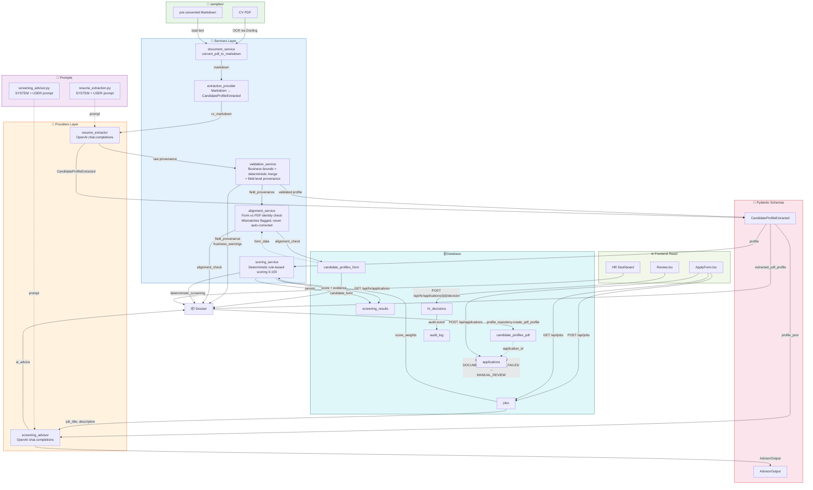

# Screening Pipeline — Architecture Flow Diagram

---

## Legend

| Color | Layer |
|---|---|
| 🟢 Green | Input sources (`samples/`) |
| 🔵 Blue | Services (pure business logic) |
| 🟠 Orange | Providers (OpenAI SDK boundary) |
| 🟣 Purple | AI prompts |
| 🔴 Pink | Pydantic schemas |
| 🩵 Cyan | Database |
| 🟢 Light green | Frontend (React) |

## Key Design Decisions

1. **Providers stop at `app/providers/`** — OpenAI SDK types never leak into services or downstream code.
2. **Validation pipeline sits between extraction and alignment** — business bounds catch impossible values before identity checks run.
3. **Field-level provenance** — each extracted field is tagged `ai`, `deterministic`, or `missing`. Deterministic fills come from date math on work_experience entries.
4. **Alignment never auto-corrects** — mismatches are flagged for HR review. Form ground truth and PDF profile stay separate.
5. **Status machine** — `APPLICATION_SUBMITTED` → `SCREENING` on success, `DOCUMENT_PROCESSING_FAILED` → `MANUAL_REVIEW` on broken PDF.
